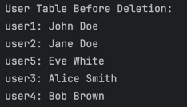
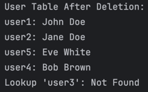

## **Task 2: User Authentication with Hash Table**

### **Description**
The second task demonstrates a hash table for securely storing user credentials. Each `User` object contains attributes such as username, hashed password, first name, surname, and email. The hash table uses the username as the key and a `User` object as the value.

### **Features**
- **Attributes**:
    - Username
    - Hashed Password
    - First Name
    - Surname
    - Email
- **Operations**:
    - **Insertion**: Add users to the hash table.
    - **Deletion**: Remove a user from the hash table by their username.
    - **Lookup**: Retrieve a user's details using their username and validate the password.

### **Usage**
1. **Insert 5 users into the hash table.**
2. **Delete one user by their username.**
3. **Validate a user's credentials through lookup.**

### **Implementation Details**
- Hashing is used to store and retrieve users efficiently.
- The hash table ensures unique usernames, with collisions resolved automatically by Java’s `HashMap` implementation.

### **Screenshots**
- **User Hash Table Before Deletion**: **
- **User Hash Table After Deletion**: **